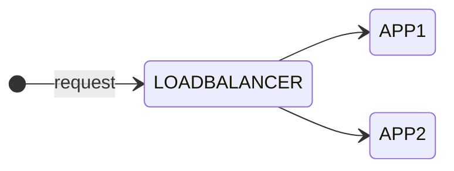

As you might know I am currently studying for the [Cisco Certified DevNet Expert](https://learningnetwork.cisco.com/s/devnet-expert){:target="_blank"} lab exam.

- Create a Docker image using Dockerfile

- Package and deploy a solution by using Docker Compose

- Package and deploy a solution by using Kubernetes

## Intro

In the first part of this blog series I show you how to create Docker images using Dockerfile and then run containers using these images. In my example, I use three containers running as an application. The application will contain the following components: A [NGNIX](https://hub.docker.com/_/nginx){:target="_blank"} load balancer container on the frontend which balances the requests between two similar application containers.



The idea for this scenario came originally from the Cisco On Demand E-Learning course [Developing Applications using Cisco Core Platforms and APIs (DEVCOR) v1.0](https://learningnetworkstore.cisco.com/on-demand-e-learning/developing-applications-using-cisco-core-platforms-and-apis-devcor-v1.0/ELT-DEVCOR-V1-024035.html){:target="_blank"} available on the [Cisco Learning Network Store](https://learningnetworkstore.cisco.com){:target="_blank"}. There was a little more complex scenario used to demonstrate containerized applications using Docker. Additionally it contained a MYSQL database in the backend to store the data which was not a container. I want keep it simple here and focus on Docker containers. Nevertheless I can highly recommend this course, especially for the labs used to demonstrate the topics.

## Create a new docker network

Let's start with creating a new Docker network to isolate the new deployment from other existing containers. By default, new docker containers will be added to the default *bridge* network and will be able to communicate with other containers on that network. Before creating a new network check for existing container networks:

```zsh
[expert@devbox ~]$ docker network ls
NETWORK ID     NAME             DRIVER    SCOPE
33b17295e975   bridge           bridge    local
43b6478812cd   gitlab_default   bridge    local
42563378bde0   host             host      local
eed3f5c39cf7   none             null      local
```

As you can see from the output there are already some Docker networks on my devbox. The Docker network mode *host* for a container means, that it is not isolated from the Docker host network stack and the container does not get its own IP address allocated. When you create a network without specifying any options, it creates a *bridge* network with non-overlapping subnetwork for the network by default. That is what we want to create.

```zsh
[expert@devbox ~]$ docker network create my-network
ade9ab9d04c4ced907112faa81acf7d1f6b6faa1dfc174bb0d1d4ac9e482b970
```

Let's inspect the details of the bridge network.

```zsh
[expert@devbox ~]$ docker network inspect my-network
[
    {
        "Name": "my-network",
        "Id": "ade9ab9d04c4ced907112faa81acf7d1f6b6faa1dfc174bb0d1d4ac9e482b970",
        "Created": "2022-09-13T22:26:48.22250377+02:00",
        "Scope": "local",
        "Driver": "bridge",
        "EnableIPv6": false,
        "IPAM": {
            "Driver": "default",
            "Options": {},
            "Config": [
                {
                    "Subnet": "172.20.0.0/16",
                    "Gateway": "172.20.0.1"
                }
            ]
        },
        "Internal": false,
        "Attachable": false,
        "Ingress": false,
        "ConfigFrom": {
            "Network": ""
        },
        "ConfigOnly": false,
        "Containers": {},
        "Options": {},
        "Labels": {}
    }
]
```

Docker automatically created a bridge network with a /16 subnet mask and assigns the first IP address as the gateway. The scope is local, no IPv6 enabled, and currently there are no containers attached to the network. So far so good for my deployment. For more information how to configure [Docker networks](https://docs.docker.com/network/){:target="_blank"} please take a look at the documentation. Now we continue with the Dockerfiles for building the images.

## Build the images from Dockerfiles

## Run the containers

## Summary and Outlook

### Links & References

- https://hub.docker.com/_/nginx
- https://docs.docker.com/network/
- [Docker Documentations](https://docs.docker.com){:target="_blank"}
