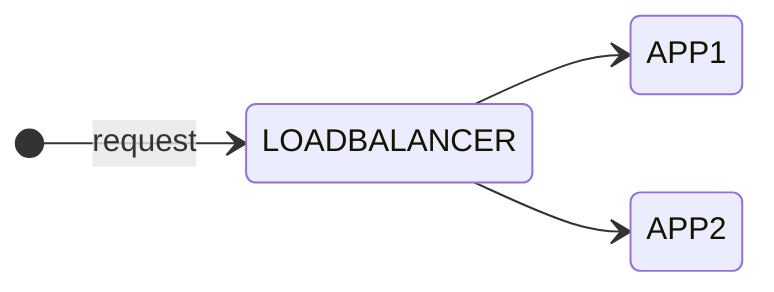

As you might know I am currently studying for the [Cisco Certified DevNet Expert](https://learningnetwork.cisco.com/s/devnet-expert){:target="_blank"} lab exam.

- Create a Docker image using Dockerfile

- Package and deploy a solution by using Docker Compose

- Package and deploy a solution by using Kubernetes

## Intro

In the first part of this blog series I show you how to create Docker images using Dockerfile and then run containers using these images. In my example, I use three containers running as an application. The application will contain the following components: A [NGNIX](https://hub.docker.com/_/nginx){:target="_blank"} load balancer container on the frontend which balances the requests between two similar application containers.



The idea for this scenario came originally from the Cisco On Demand E-Learning course [Developing Applications using Cisco Core Platforms and APIs (DEVCOR) v1.0](https://learningnetworkstore.cisco.com/on-demand-e-learning/developing-applications-using-cisco-core-platforms-and-apis-devcor-v1.0/ELT-DEVCOR-V1-024035.html){:target="_blank"} available on the [Cisco Learning Network Store](https://learningnetworkstore.cisco.com){:target="_blank"}. There was a little more complex scenario used to demonstrate containerized applications using Docker. Additionally it contained a MYSQL database in the backend to store the data which was not a container. I want keep it simple here and focus on Docker containers. Nevertheless I can highly recommend this course, especially for the labs used to demonstrate the topics.

## Create a new docker network

Let's start with creating a new Docker network to isolate the new deployment from other existing containers. By default, new docker containers will be added to the default *bridge* network and will be able to communicate with other containers on that network. Before creating a new network check for existing container networks:

```zsh
[expert@devbox ~]$ docker network ls
NETWORK ID     NAME             DRIVER    SCOPE
33b17295e975   bridge           bridge    local
43b6478812cd   gitlab_default   bridge    local
42563378bde0   host             host      local
eed3f5c39cf7   none             null      local
```

As you can see from the output there are already some Docker networks on my devbox. The Docker network mode *host* for a container means, that it is not isolated from the Docker host network stack and the container does not get its own IP address allocated. When you create a network without specifying any options, it creates a *bridge* network with non-overlapping subnetwork for the network by default. That is what we want to create.

```zsh
[expert@devbox ~]$ docker network create my-network
ade9ab9d04c4ced907112faa81acf7d1f6b6faa1dfc174bb0d1d4ac9e482b970
```

Let's inspect the details of the bridge network.

```zsh
[expert@devbox ~]$ docker network inspect my-network
[
    {
        "Name": "my-network",
        "Id": "ade9ab9d04c4ced907112faa81acf7d1f6b6faa1dfc174bb0d1d4ac9e482b970",
        "Created": "2022-09-13T22:26:48.22250377+02:00",
        "Scope": "local",
        "Driver": "bridge",
        "EnableIPv6": false,
        "IPAM": {
            "Driver": "default",
            "Options": {},
            "Config": [
                {
                    "Subnet": "172.20.0.0/16",
                    "Gateway": "172.20.0.1"
                }
            ]
        },
        "Internal": false,
        "Attachable": false,
        "Ingress": false,
        "ConfigFrom": {
            "Network": ""
        },
        "ConfigOnly": false,
        "Containers": {},
        "Options": {},
        "Labels": {}
    }
]
```

Docker automatically created a bridge network with a /16 subnet mask and assigns the first IP address as the gateway. The scope is local, no IPv6 enabled, and currently there are no containers attached to the network. So far so good for my deployment. For more information how to configure [Docker networks](https://docs.docker.com/network/){:target="_blank"} please take a look at the documentation. Now we continue with the Dockerfiles for building the images.

## Build the images from Dockerfiles

```zsh
events {}
http {
  upstream myapp {
    server 172.20.0.100:5000;
    server 172.20.0.101:5000;
  }

  server {
    listen 8080;
    server_name localhost;

    location / {
      proxy_pass http://myapp;
      proxy_set_header Host $host;
    }
  }
}
```

```docker
FROM nginx

COPY nginx.conf /etc/nginx/nginx.conf

EXPOSE 8080

CMD ["nginx", "-g", "daemon off;"]
```

If you add a custom CMD in the Dockerfile, be sure to include -g daemon off; in the CMD in order for nginx to stay in the foreground, so that Docker can track the process properly (otherwise your container will stop immediately after starting)!

Then build the image with docker build -t ngnix-lb . and run it as follows:

```zsh
[expert@devbox lb]$ docker build -t nginx-lb .
Sending build context to Docker daemon  3.072kB
Step 1/4 : FROM nginx
latest: Pulling from library/nginx
31b3f1ad4ce1: Pull complete 
fd42b079d0f8: Pull complete 
30585fbbebc6: Pull complete 
18f4ffdd25f4: Pull complete 
9dc932c8fba2: Pull complete 
600c24b8ba39: Pull complete 
Digest: sha256:0b970013351304af46f322da1263516b188318682b2ab1091862497591189ff1
Status: Downloaded newer image for nginx:latest
 ---> 2d389e545974
Step 2/4 : COPY nginx.conf /etc/nginx/nginx.conf
 ---> bd2553d2dc5f
Step 3/4 : EXPOSE 8080
 ---> Running in b41f852200da
Removing intermediate container b41f852200da
 ---> 2bf0f4b7f95b
Step 4/4 : CMD ["nginx", "-g", "daemon off;"]
 ---> Running in 696f6122f09f
Removing intermediate container 696f6122f09f
 ---> 6162199d1567
Successfully built 6162199d1567
Successfully tagged nginx-lb:latest
```

docker run --name my-nginx-lb -d nginx-lb

Connect to my Docker network

docker network connect my-network my-nginx

```zsh
[expert@devbox lb]$ docker network inspect my-network
[
    {
        "Name": "my-network",
        "Id": "ade9ab9d04c4ced907112faa81acf7d1f6b6faa1dfc174bb0d1d4ac9e482b970",
        "Created": "2022-09-13T22:26:48.22250377+02:00",
        "Scope": "local",
        "Driver": "bridge",
        "EnableIPv6": false,
        "IPAM": {
            "Driver": "default",
            "Options": {},
            "Config": [
                {
                    "Subnet": "172.20.0.0/16",
                    "Gateway": "172.20.0.1"
                }
            ]
        },
        "Internal": false,
        "Attachable": false,
        "Ingress": false,
        "ConfigFrom": {
            "Network": ""
        },
        "ConfigOnly": false,
        "Containers": {
            "a123a9ea0d879a58c2e0ab9cba71ab7b4deff23a27ff2f56a783e10c42594722": {
                "Name": "my-nginx-lb",
                "EndpointID": "690b8d01b912c3922f37f7112ae7eefcc3312c66279045a7fa7d8a1aec336673",
                "MacAddress": "02:42:ac:14:00:02",
                "IPv4Address": "172.20.0.2/16",
                "IPv6Address": ""
            }
        },
        "Options": {},
        "Labels": {}
    }
]
```


```docker
FROM python:3.7

COPY . /app
WORKDIR /app

RUN pip install -r requirements.txt
EXPOSE 5000

CMD ["python3", "main.py"]
```

```zsh
[expert@devbox app]$ docker build -t flask-app .
Sending build context to Docker daemon  3.072kB
Step 1/6 : FROM python:3.7
3.7: Pulling from library/python
23858da423a6: Pull complete 
326f452ade5c: Pull complete 
a42821cd14fb: Pull complete 
8471b75885ef: Pull complete 
8ffa7aaef404: Pull complete 
15132af73342: Pull complete 
a81a13cb42bc: Pull complete 
39baa166dda6: Pull complete 
28d172f530ba: Pull complete 
Digest: sha256:249a4d1d1fedfcc2c3ea02b6e6e009be818e4153cc8f7353810529bb54c5d876
Status: Downloaded newer image for python:3.7
 ---> 7d2ecbd72983
Step 2/6 : COPY . /app
 ---> 37c21165ecbd
Step 3/6 : WORKDIR /app
 ---> Running in 274604dd87ce
Removing intermediate container 274604dd87ce
 ---> 0813156ce6ea
Step 4/6 : RUN pip install flask
 ---> Running in 4d59003da528
Collecting flask
  Downloading Flask-2.2.2-py3-none-any.whl (101 kB)
     ━━━━━━━━━━━━━━━━━━━━━━━━━━━━━━━━━━━━━━━ 101.5/101.5 KB 1.5 MB/s eta 0:00:00
Collecting Jinja2>=3.0
  Downloading Jinja2-3.1.2-py3-none-any.whl (133 kB)
     ━━━━━━━━━━━━━━━━━━━━━━━━━━━━━━━━━━━━━━━ 133.1/133.1 KB 1.9 MB/s eta 0:00:00
Collecting itsdangerous>=2.0
  Downloading itsdangerous-2.1.2-py3-none-any.whl (15 kB)
Collecting click>=8.0
  Downloading click-8.1.3-py3-none-any.whl (96 kB)
     ━━━━━━━━━━━━━━━━━━━━━━━━━━━━━━━━━━━━━━━━ 96.6/96.6 KB 2.8 MB/s eta 0:00:00
Collecting importlib-metadata>=3.6.0
  Downloading importlib_metadata-4.12.0-py3-none-any.whl (21 kB)
Collecting Werkzeug>=2.2.2
  Downloading Werkzeug-2.2.2-py3-none-any.whl (232 kB)
     ━━━━━━━━━━━━━━━━━━━━━━━━━━━━━━━━━━━━━━━ 232.7/232.7 KB 5.2 MB/s eta 0:00:00
Collecting zipp>=0.5
  Downloading zipp-3.8.1-py3-none-any.whl (5.6 kB)
Collecting typing-extensions>=3.6.4
  Downloading typing_extensions-4.3.0-py3-none-any.whl (25 kB)
Collecting MarkupSafe>=2.0
  Downloading MarkupSafe-2.1.1-cp37-cp37m-manylinux_2_17_x86_64.manylinux2014_x86_64.whl (25 kB)
Installing collected packages: zipp, typing-extensions, MarkupSafe, itsdangerous, Werkzeug, Jinja2, importlib-metadata, click, flask
Successfully installed Jinja2-3.1.2 MarkupSafe-2.1.1 Werkzeug-2.2.2 click-8.1.3 flask-2.2.2 importlib-metadata-4.12.0 itsdangerous-2.1.2 typing-extensions-4.3.0 zipp-3.8.1
Removing intermediate container 4d59003da528
 ---> fb49696f122e
Step 5/6 : EXPOSE 5000
 ---> Running in 961ef653dac6
Removing intermediate container 961ef653dac6
 ---> e5abbe7313a0
Step 6/6 : CMD ["python3", "main.py"]
 ---> Running in 12e2d9b7f755
Removing intermediate container 12e2d9b7f755
 ---> 5e0fa157a6d2
Successfully built 5e0fa157a6d2
Successfully tagged flask-app:latest
```

## Run the containers

## Summary and Outlook

### Links & References

- https://hub.docker.com/_/nginx
- https://docs.docker.com/network/
- [Docker Documentations](https://docs.docker.com){:target="_blank"}
