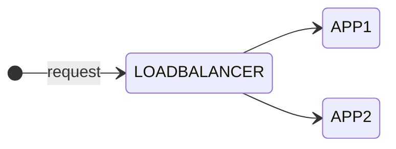

As you might know I am currently studying for the [Cisco Certified DevNet Expert](https://learningnetwork.cisco.com/s/devnet-expert){:target="_blank"} lab exam.

- Create a Docker image using Dockerfile

- Package and deploy a solution by using Docker Compose

- Package and deploy a solution by using Kubernetes

## Intro

In the first part of this blog series I show you how to create Docker images using Dockerfile and then run containers using these images. In my example, I use three containers running as an application. The application will contain the following components: A [NGNIX](https://hub.docker.com/_/nginx){:target="_blank"} load balancer container on the frontend which balances the requests between two similar application containers.



The idea for this scenario came originally from the Cisco On Demand E-Learning course [Developing Applications using Cisco Core Platforms and APIs (DEVCOR) v1.0](https://learningnetworkstore.cisco.com/on-demand-e-learning/developing-applications-using-cisco-core-platforms-and-apis-devcor-v1.0/ELT-DEVCOR-V1-024035.html){:target="_blank"} available on the [Cisco Learning Network Store](https://learningnetworkstore.cisco.com){:target="_blank"}. There was a little more complex scenario used to demonstrate containerized applications using Docker. Additionally it contained a MYSQL database in the backend to store the data which was not a container. I want keep it simple here and focus on Docker containers. Nevertheless I can highly recommend this course, especially for the labs used to demonstrate the topics.

Before I begin let's make sure that Docker is running on my machine. I am using Docker Desktop version 4.12.0 (85629) on Apple MacBook Pro macOS Monterey version 12.6.

```zsh
$ docker version
Client:
 Cloud integration: v1.0.29
 Version:           20.10.17
 API version:       1.41
 Go version:        go1.17.11
 Git commit:        100c701
 Built:             Mon Jun  6 23:04:45 2022
 OS/Arch:           darwin/arm64
 Context:           default
 Experimental:      true

Server: Docker Desktop 4.12.0 (85629)
 Engine:
  Version:          20.10.17
  API version:      1.41 (minimum version 1.12)
  Go version:       go1.17.11
  Git commit:       a89b842
  Built:            Mon Jun  6 23:01:01 2022
  OS/Arch:          linux/arm64
  Experimental:     false
 containerd:
  Version:          1.6.8
  GitCommit:        9cd3357b7fd7218e4aec3eae239db1f68a5a6ec6
 runc:
  Version:          1.1.4
  GitCommit:        v1.1.4-0-g5fd4c4d
 docker-init:
  Version:          0.19.0
  GitCommit:        de40ad0
```

## Create a new docker network

Let's start with creating a new Docker network to isolate the new deployment from other existing containers. By default, new Docker containers will be added to the default *bridge* network and will be able to communicate with other containers on that network. Before creating a new network I check for existing container networks:

```zsh
$ docker network ls   
NETWORK ID     NAME      DRIVER    SCOPE
b561344e969a   bridge    bridge    local
85292295a34d   host      host      local
9c55956a8c6f   none      null      local
```

As you can see from the output there are only default Docker networks on my machine. The Docker network mode *host* for a container means, that it is not isolated from the Docker host network stack and the container does not get its own IP address allocated. When you create a network without specifying any options, it creates a *bridge* network with non-overlapping subnetwork for the network by default. That is what we want to create.

```zsh
$ docker network create my-network 
9c161e4d72f551f73b8ace265b5642b55950dd3c17bba65c2108e2bda2ae3319
```

Let's inspect the details of the bridge network.

```zsh
$ docker network inspect my-network
[
    {
        "Name": "my-network",
        "Id": "9c161e4d72f551f73b8ace265b5642b55950dd3c17bba65c2108e2bda2ae3319",
        "Created": "2022-09-21T18:29:27.031196834Z",
        "Scope": "local",
        "Driver": "bridge",
        "EnableIPv6": false,
        "IPAM": {
            "Driver": "default",
            "Options": {},
            "Config": [
                {
                    "Subnet": "172.19.0.0/16",
                    "Gateway": "172.19.0.1"
                }
            ]
        },
        "Internal": false,
        "Attachable": false,
        "Ingress": false,
        "ConfigFrom": {
            "Network": ""
        },
        "ConfigOnly": false,
        "Containers": {},
        "Options": {},
        "Labels": {}
    }
]
```

As you can see from the output, Docker created a bridge network by default with a local subnet of 172.19.0.0/16 with gateway 172.19.0.1. No other specific settings were made and currently there are no containers attached to the network. For more information about Docker networking please look at the [Docker Networking](https://docs.docker.com/network/){:target="_blank"} documentation. Let's move on and create the Docker images from a Dockerfile.

## Create Docker images

First let's create two folders *app* and *lb* to separate the Dockerfiles and container specific files. Then we start with creating the Dockerfile for the application image in the *app* directory:

```docker
FROM python:3.9

COPY . /app
WORKDIR /app

RUN pip install flask
EXPOSE tcp/5000

CMD ["python3", "main.py"]
```

We use the official Docker image *python* from [Docker Hub](https://hub.docker.com){:target="_blank"} in version 3.9. Official Docker images are designed for most common use cases. They have clear documentation and use Docker best practices. The *COPY* statement is used to copy local files to a directory on the container. Then set the working directory with *WORKDIR* for the app. After that the container needs to install the Python library *flask* which is a lightweight web application framework which is used in the *main.py* file. We will look at it in a minute. The app will start the app with the *CMD* statement. Before that the *EXPOSE* statement is used to enable the container listening on the specified port, in our case tcp port 5000. The statements in the Dockerfile are called stages. When we build the Docker image we will see the different stages:

```zsh
$ docker build -t my-app .
[+] Building 24.6s (9/9) FINISHED                                                                                         
 => [internal] load build definition from Dockerfile                                                                 0.0s
 => => transferring dockerfile: 146B                                                                                 0.0s
 => [internal] load .dockerignore                                                                                    0.0s
 => => transferring context: 2B                                                                                      0.0s
 => [internal] load metadata for docker.io/library/python:3.9                                                        2.1s
 => [internal] load build context                                                                                    0.0s
 => => transferring context: 494B                                                                                    0.0s
 => [1/4] FROM docker.io/library/python:3.9@sha256:cfcc9ef77b6cf87f57327aacc6f9b50c7cdb4d7dd93662a36549f05b7403cd4  20.0s
 => => resolve docker.io/library/python:3.9@sha256:cfcc9ef77b6cf87f57327aacc6f9b50c7cdb4d7dd93662a36549f05b7403cd47  0.0s
 => => sha256:cfcc9ef77b6cf87f57327aacc6f9b50c7cdb4d7dd93662a36549f05b7403cd47 1.86kB / 1.86kB                       0.0s
 => => sha256:644efdc0e0b3ba36050cb12e27d074e3a15ca68a3f41ae96e42bdc0af720da05 2.22kB / 2.22kB                       0.0s
 => => sha256:daa25dbffbabb85498e5d2c2d270f81ca67f9679617c9611bf18faf6ed4a09a0 10.66MB / 10.66MB                     1.9s
 => => sha256:d732b9878117efd35e3ac57ec9db1daefb52e73424878b91c2bf006a44876b2e 8.53kB / 8.53kB                       0.0s
 => => sha256:10cff8997b4d4f243419e6bede830f1ac33f3d18c5200e5fb80e19333883ec2b 53.69MB / 53.69MB                     5.0s
 => => sha256:4c9f2bf6f4deeb7ed2acd14f7997ec0a0cdf45b5b314051ddaab1911e22d997d 5.15MB / 5.15MB                       1.2s
 => => sha256:a9360b3024e18f921a2fcec8614f617312c87ea1a31b5c94c9c643535bde9775 54.68MB / 54.68MB                     8.3s
 => => sha256:9175ba771bff9348347af555b31874fcf715783d5265e9282369fbcb0f5048c5 189.72MB / 189.72MB                  14.4s
 => => sha256:9273f03e50bc5a05d868e3daa064af40309676421aaf7b2460bad3ae69482331 6.16MB / 6.16MB                       6.1s
 => => extracting sha256:10cff8997b4d4f243419e6bede830f1ac33f3d18c5200e5fb80e19333883ec2b                            1.5s
 => => sha256:b9e722e88430b63dff46f6dedbbda5be70950dca96aa4297b2d3e656148aefd9 17.92MB / 17.92MB                     9.2s
 => => extracting sha256:4c9f2bf6f4deeb7ed2acd14f7997ec0a0cdf45b5b314051ddaab1911e22d997d                            0.1s
 => => extracting sha256:daa25dbffbabb85498e5d2c2d270f81ca67f9679617c9611bf18faf6ed4a09a0                            0.2s
 => => sha256:97425eb7e05c8eaf1edc78540e3275610a5074d47c96807f23f62f3962712620 234B / 234B                           8.4s
 => => extracting sha256:a9360b3024e18f921a2fcec8614f617312c87ea1a31b5c94c9c643535bde9775                            1.7s
 => => sha256:751570a0fcefd6c1e6f7735c1acaee06a6c84eebfce5e739aca725737ddc355f 2.88MB / 2.88MB                       8.9s
 => => extracting sha256:9175ba771bff9348347af555b31874fcf715783d5265e9282369fbcb0f5048c5                            4.5s
 => => extracting sha256:9273f03e50bc5a05d868e3daa064af40309676421aaf7b2460bad3ae69482331                            0.2s
 => => extracting sha256:b9e722e88430b63dff46f6dedbbda5be70950dca96aa4297b2d3e656148aefd9                            0.5s
 => => extracting sha256:97425eb7e05c8eaf1edc78540e3275610a5074d47c96807f23f62f3962712620                            0.0s
 => => extracting sha256:751570a0fcefd6c1e6f7735c1acaee06a6c84eebfce5e739aca725737ddc355f                            0.1s
 => [2/4] COPY . /app                                                                                                0.4s
 => [3/4] WORKDIR /app                                                                                               0.0s
 => [4/4] RUN pip install flask                                                                                      1.9s
 => exporting to image                                                                                               0.1s
 => => exporting layers                                                                                              0.1s
 => => writing image sha256:8f0931edc49de029de1c8250c36596f10676f2703d769584e291c0cdd0ba40f2                         0.0s
 => => naming to docker.io/library/my-app   
```

You can see that four stages were completed. The fifth and sixth stages which are related to the *EXPOSE* and *CMD* statements will be executed during image run. Let's check if the image is there:

```zsh
$ docker image ls
REPOSITORY                      TAG         IMAGE ID       CREATED         SIZE
my-app                          latest      8f0931edc49d   9 minutes ago   875MB
< output omitted>
```

With ```docker image inspect my-app``` you could take a look into the details of the image. I did not add the output here to avoid overloading this post with information. Now let's take a look at the 

```zsh
[expert@devbox ~]$ docker run --name my-flask-app1 -d flask-app
8e5319a9cd35ccf94e6837e32fca8ad9ad0a8990c39be78c79327db9bd567356
[expert@devbox ~]$ docker ps
CONTAINER ID   IMAGE                  COMMAND                  CREATED         STATUS                 PORTS                                                NAMES
8e5319a9cd35   flask-app              "python3 main.py"        8 seconds ago   Up 4 seconds           5000/tcp                                             my-flask-app1
a123a9ea0d87   nginx-lb               "/docker-entrypoint.…"   6 days ago      Up 6 days              80/tcp, 8080/tcp                                     my-nginx-lb
```

docker network connect my-network my-flask-app1

## Run the containers

## Summary and Outlook

### Links & References

#### NGINX

- [NGINX on Docker Hub](https://hub.docker.com/_/nginx){:target="_blank"}

#### Docker

- [Docker Documentation](https://docs.docker.com){:target="_blank"}
- [Docker Networking Overview](https://docs.docker.com/network/){:target="_blank"}
- [Docker Hub](https://hub.docker.com){:target="_blank"}

#### Python

- [Flask](https://pypi.org/project/Flask/){:target="_blank"}
