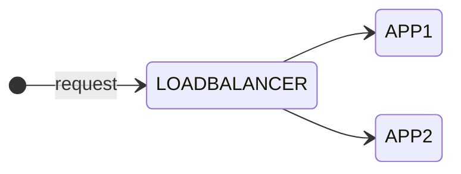

As you might know I am currently studying for the [Cisco Certified DevNet Expert](https://learningnetwork.cisco.com/s/devnet-expert){:target="_blank"} lab exam.

- Create a Docker image using Dockerfile

- Package and deploy a solution by using Docker Compose

- Package and deploy a solution by using Kubernetes

## Intro

In the first part of this blog series I show you how to create Docker images using Dockerfile and then run containers using these images. In my example, I use three containers running as an application. The application will contain the following components: A [NGNIX](https://hub.docker.com/_/nginx){:target="_blank"} load balancer container on the frontend which balances the requests between two similar application containers.



The idea for this scenario came originally from the Cisco On Demand E-Learning course [Developing Applications using Cisco Core Platforms and APIs (DEVCOR) v1.0](https://learningnetworkstore.cisco.com/on-demand-e-learning/developing-applications-using-cisco-core-platforms-and-apis-devcor-v1.0/ELT-DEVCOR-V1-024035.html){:target="_blank"} available on the [Cisco Learning Network Store](https://learningnetworkstore.cisco.com){:target="_blank"}. There was a little more complex scenario used to demonstrate containerized applications using Docker. Additionally it contained a MYSQL database in the backend to store the data which was not a container. I want keep it simple here and focus on Docker containers. Nevertheless I can highly recommend this course, especially for the labs used to demonstrate the topics.

Before I begin let's make sure that Docker is running on my machine. I am using Docker Desktop version 4.12.0 (85629) on Apple MacBook Pro macOS Monterey version 12.6.

```zsh
$ docker version
Client:
 Cloud integration: v1.0.29
 Version:           20.10.17
 API version:       1.41
 Go version:        go1.17.11
 Git commit:        100c701
 Built:             Mon Jun  6 23:04:45 2022
 OS/Arch:           darwin/arm64
 Context:           default
 Experimental:      true

Server: Docker Desktop 4.12.0 (85629)
 Engine:
  Version:          20.10.17
  API version:      1.41 (minimum version 1.12)
  Go version:       go1.17.11
  Git commit:       a89b842
  Built:            Mon Jun  6 23:01:01 2022
  OS/Arch:          linux/arm64
  Experimental:     false
 containerd:
  Version:          1.6.8
  GitCommit:        9cd3357b7fd7218e4aec3eae239db1f68a5a6ec6
 runc:
  Version:          1.1.4
  GitCommit:        v1.1.4-0-g5fd4c4d
 docker-init:
  Version:          0.19.0
  GitCommit:        de40ad0
```

## Create a new docker network

Let's start with creating a new Docker network to isolate the new deployment from other existing containers. By default, new docker containers will be added to the default *bridge* network and will be able to communicate with other containers on that network. Before creating a new network I check for existing container networks:

```zsh
$ docker network ls   
NETWORK ID     NAME      DRIVER    SCOPE
b561344e969a   bridge    bridge    local
85292295a34d   host      host      local
9c55956a8c6f   none      null      local
```

As you can see from the output there are only default Docker networks on my machine. The Docker network mode *host* for a container means, that it is not isolated from the Docker host network stack and the container does not get its own IP address allocated. When you create a network without specifying any options, it creates a *bridge* network with non-overlapping subnetwork for the network by default. That is what we want to create.

```zsh
$ docker network create my-network
609d0654ad91262ff0ee8fd15b1dc44e008c04a0d736fbb4f510201a96aecec2
```

Let's inspect the details of the bridge network.

```zsh
$ docker network inspect my-network
[
    {
        "Name": "my-network",
        "Id": "609d0654ad91262ff0ee8fd15b1dc44e008c04a0d736fbb4f510201a96aecec2",
        "Created": "2022-09-21T16:42:41.218769509Z",
        "Scope": "local",
        "Driver": "bridge",
        "EnableIPv6": false,
        "IPAM": {
            "Driver": "default",
            "Options": {},
            "Config": [
                {
                    "Subnet": "172.18.0.0/16",
                    "Gateway": "172.18.0.1"
                }
            ]
        },
        "Internal": false,
        "Attachable": false,
        "Ingress": false,
        "ConfigFrom": {
            "Network": ""
        },
        "ConfigOnly": false,
        "Containers": {},
        "Options": {},
        "Labels": {}
    }
]
```

As you can see from the output, Docker created a bridge network by default with a local subnet of 172.18.0.0/16 with gateway 172.18.0.1. No other specific settings were made. For more information about Docker networking I recommend looking at the [Docker Networking](https://docs.docker.com/network/){:target="_blank"} documentation.

## Create Docker images

```docker
FROM python:3.7

COPY . /app
WORKDIR /app

RUN pip install flask
EXPOSE 5000

CMD ["python3", "main.py"]
```

```zsh
[expert@devbox app]$ docker build -t flask-app .
Sending build context to Docker daemon  3.072kB
Step 1/6 : FROM python:3.7
3.7: Pulling from library/python
23858da423a6: Pull complete 
326f452ade5c: Pull complete 
a42821cd14fb: Pull complete 
8471b75885ef: Pull complete 
8ffa7aaef404: Pull complete 
15132af73342: Pull complete 
a81a13cb42bc: Pull complete 
39baa166dda6: Pull complete 
28d172f530ba: Pull complete 
Digest: sha256:249a4d1d1fedfcc2c3ea02b6e6e009be818e4153cc8f7353810529bb54c5d876
Status: Downloaded newer image for python:3.7
 ---> 7d2ecbd72983
Step 2/6 : COPY . /app
 ---> 37c21165ecbd
Step 3/6 : WORKDIR /app
 ---> Running in 274604dd87ce
Removing intermediate container 274604dd87ce
 ---> 0813156ce6ea
Step 4/6 : RUN pip install flask
 ---> Running in 4d59003da528
Collecting flask
  Downloading Flask-2.2.2-py3-none-any.whl (101 kB)
     ━━━━━━━━━━━━━━━━━━━━━━━━━━━━━━━━━━━━━━━ 101.5/101.5 KB 1.5 MB/s eta 0:00:00
Collecting Jinja2>=3.0
  Downloading Jinja2-3.1.2-py3-none-any.whl (133 kB)
     ━━━━━━━━━━━━━━━━━━━━━━━━━━━━━━━━━━━━━━━ 133.1/133.1 KB 1.9 MB/s eta 0:00:00
Collecting itsdangerous>=2.0
  Downloading itsdangerous-2.1.2-py3-none-any.whl (15 kB)
Collecting click>=8.0
  Downloading click-8.1.3-py3-none-any.whl (96 kB)
     ━━━━━━━━━━━━━━━━━━━━━━━━━━━━━━━━━━━━━━━━ 96.6/96.6 KB 2.8 MB/s eta 0:00:00
Collecting importlib-metadata>=3.6.0
  Downloading importlib_metadata-4.12.0-py3-none-any.whl (21 kB)
Collecting Werkzeug>=2.2.2
  Downloading Werkzeug-2.2.2-py3-none-any.whl (232 kB)
     ━━━━━━━━━━━━━━━━━━━━━━━━━━━━━━━━━━━━━━━ 232.7/232.7 KB 5.2 MB/s eta 0:00:00
Collecting zipp>=0.5
  Downloading zipp-3.8.1-py3-none-any.whl (5.6 kB)
Collecting typing-extensions>=3.6.4
  Downloading typing_extensions-4.3.0-py3-none-any.whl (25 kB)
Collecting MarkupSafe>=2.0
  Downloading MarkupSafe-2.1.1-cp37-cp37m-manylinux_2_17_x86_64.manylinux2014_x86_64.whl (25 kB)
Installing collected packages: zipp, typing-extensions, MarkupSafe, itsdangerous, Werkzeug, Jinja2, importlib-metadata, click, flask
Successfully installed Jinja2-3.1.2 MarkupSafe-2.1.1 Werkzeug-2.2.2 click-8.1.3 flask-2.2.2 importlib-metadata-4.12.0 itsdangerous-2.1.2 typing-extensions-4.3.0 zipp-3.8.1
Removing intermediate container 4d59003da528
 ---> fb49696f122e
Step 5/6 : EXPOSE 5000
 ---> Running in 961ef653dac6
Removing intermediate container 961ef653dac6
 ---> e5abbe7313a0
Step 6/6 : CMD ["python3", "main.py"]
 ---> Running in 12e2d9b7f755
Removing intermediate container 12e2d9b7f755
 ---> 5e0fa157a6d2
Successfully built 5e0fa157a6d2
Successfully tagged flask-app:latest
```

```zsh
[expert@devbox ~]$ docker run --name my-flask-app1 -d flask-app
8e5319a9cd35ccf94e6837e32fca8ad9ad0a8990c39be78c79327db9bd567356
[expert@devbox ~]$ docker ps
CONTAINER ID   IMAGE                  COMMAND                  CREATED         STATUS                 PORTS                                                NAMES
8e5319a9cd35   flask-app              "python3 main.py"        8 seconds ago   Up 4 seconds           5000/tcp                                             my-flask-app1
a123a9ea0d87   nginx-lb               "/docker-entrypoint.…"   6 days ago      Up 6 days              80/tcp, 8080/tcp                                     my-nginx-lb
```

docker network connect my-network my-flask-app1

## Run the containers

## Summary and Outlook

### Links & References

#### NGINX

- [NGINX on Docker Hub](https://hub.docker.com/_/nginx){:target="_blank"}

#### Docker

- [Docker Documentation](https://docs.docker.com){:target="_blank"}
- [Docker Networking Overview](https://docs.docker.com/network/){:target="_blank"}
