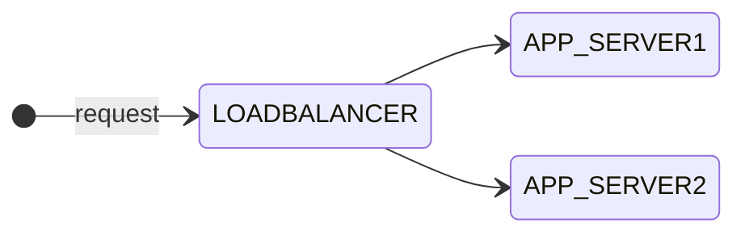

As you might know I am currently studying for the [Cisco Certified DevNet Expert](https://learningnetwork.cisco.com/s/devnet-expert){:target="_blank"} lab exam.

ADD MORE INTRO HERE!

- Create a Docker image using Dockerfile

- Package and deploy a solution by using Docker Compose

- Package and deploy a solution by using Kubernetes

- Create, consume, and troubleshoot a Docker host and bridge-based networks and integrate them with external networks

### Part 1: Docker images using Dockerfile

In the first part of this blog series I will show you how to create Docker images using Dockerfile and then run containers using these images. In my example, I use three containers running as an application. The application will contain the following components: A [NGNIX](https://hub.docker.com/_/nginx){:target="_blank"} load balancer container on the frontend which balances the requests between two similar application containers named APP1 and APP2.



The idea for this scenario came originally from the Cisco On Demand E-Learning course [Developing Applications using Cisco Core Platforms and APIs (DEVCOR) v1.0](https://learningnetworkstore.cisco.com/on-demand-e-learning/developing-applications-using-cisco-core-platforms-and-apis-devcor-v1.0/ELT-DEVCOR-V1-024035.html){:target="_blank"} available on the [Cisco Learning Network Store](https://learningnetworkstore.cisco.com){:target="_blank"}. There was a little more complex scenario used to demonstrate containerized applications using Docker. Additionally it contained a MYSQL database in the backend to store the data which was not a container. I want to keep it simple here and focus on Docker containers. Nevertheless I can highly recommend this course, especially for the labs used to demonstrate the topics.

Before we start, let's make sure that Docker is running on my machine. I am using a virtual machine running Ubuntu 20.04.

```bash
developer@devbox:~$ docker version
Client:
 Version:           20.10.12
 API version:       1.41
 Go version:        go1.16.2
 Git commit:        20.10.12-0ubuntu2~20.04.1
 Built:             Wed Apr  6 02:14:38 2022
 OS/Arch:           linux/amd64
 Context:           default
 Experimental:      true

Server:
 Engine:
  Version:          20.10.12
  API version:      1.41 (minimum version 1.12)
  Go version:       go1.16.2
  Git commit:       20.10.12-0ubuntu2~20.04.1
  Built:            Thu Feb 10 15:03:35 2022
  OS/Arch:          linux/amd64
  Experimental:     false
 containerd:
  Version:          1.5.9-0ubuntu1~20.04.4
  GitCommit:        
 runc:
  Version:          1.1.0-0ubuntu1~20.04.1
  GitCommit:        
 docker-init:
  Version:          0.19.0
  GitCommit:        
```

> *If Docker is not running on your machine you can check the [Install Docker Engine documentation](https://docs.docker.com/engine/install/){:target="_blank"} to look for instructions for your machine. I would also recommend to go through the [Post-installation steps for Linux](https://docs.docker.com/engine/install/linux-postinstall/){:target="_blank"} after you installed it.*

Docker is already running on my machine. Now let's check if there are any containers running or if there are any images:

```bash
developer@devbox:~$ docker ps -a
CONTAINER ID   IMAGE     COMMAND   CREATED   STATUS    PORTS     NAMES
# no container
developer@devbox:~$ docker image ls
REPOSITORY    TAG       IMAGE ID       CREATED         SIZE
# no image
developer@devbox:~$
```

The `docker ps` command lists containers and with the option `-a` it shows all containers, because by default it shows only running containers. The `docker image` command manages images and with the option `ls` it lists all locally available images. Nothing there so far, we have a green field. Now we quickly try running an official Docker image called [hello-world](https://hub.docker.com/_/hello-world){:target="_blank"} to test the Docker setup. I will explain the official Docker images in a minute.

```bash
developer@devbox:~$ docker run hello-world
Unable to find image 'hello-world:latest' locally
latest: Pulling from library/hello-world
2db29710123e: Pull complete 
Digest: sha256:18a657d0cc1c7d0678a3fbea8b7eb4918bba25968d3e1b0adebfa71caddbc346
Status: Downloaded newer image for hello-world:latest

Hello from Docker!
This message shows that your installation appears to be working correctly.

To generate this message, Docker took the following steps:
 1. The Docker client contacted the Docker daemon.
 2. The Docker daemon pulled the "hello-world" image from the Docker Hub.
    (amd64)
 3. The Docker daemon created a new container from that image which runs the
    executable that produces the output you are currently reading.
 4. The Docker daemon streamed that output to the Docker client, which sent it
    to your terminal.

To try something more ambitious, you can run an Ubuntu container with:
 $ docker run -it ubuntu bash

Share images, automate workflows, and more with a free Docker ID:
 https://hub.docker.com/

For more examples and ideas, visit:
 https://docs.docker.com/get-started/

```

As you can see from the output the command started a container using the image *hello-world*. Docker could not find it locally and then the steps described above were done. If we list now the containers and images again we will see more than before:

```bash
developer@devbox:~$ docker ps -a
CONTAINER ID   IMAGE         COMMAND    CREATED          STATUS                      PORTS     NAMES
824970e1855e   hello-world   "/hello"   22 minutes ago   Exited (0) 3 minutes ago             objective_neumann

developer@devbox:~$ docker image ls
REPOSITORY    TAG       IMAGE ID       CREATED         SIZE
hello-world   latest    feb5d9fea6a5   13 months ago   13.3kB
developer@devbox:~$
```

The container was created but stopped after it streamed the output to my terminal as you can see from the status. The *hello-world* image is now available locally. If you run it again there is no need to download it. Now I will show you how we create your own images from a Dockerfile and create containers running for the scenario described before.

#### Create the APP image

First let's create two folders *app* and *lb* to separate the Dockerfiles and container specific files.

```none
developer@devbox:~$ mkdir app lb
developer@devbox:~$ tree
.
├── app
└── lb

2 directories, 0 files
```

Then we create a Dockerfile with the filename *Dockerfile* for the application image in the *app* directory. The Dockerfile will later be recognized when we run the ```docker build .``` command later from the app folder to build the image.

```docker
FROM python:3.9

COPY . /app
WORKDIR /app

RUN python3 -m venv venv
RUN venv/bin/python3 -m pip install --upgrade pip
RUN venv/bin/pip install flask

EXPOSE 5000/tcp

CMD ["venv/bin/python3", "main.py"]
```

We use the official Docker image *python* from [Docker Hub](https://hub.docker.com){:target="_blank"} in version 3.9 and specify it with the *FROM* statement. Official Docker images are designed for most common use cases. They have clear documentation and use Docker best practices. The *COPY* statement is used to copy local files to a directory on the container. Then we set the working directory with *WORKDIR* for the app. After that the container creates a virtual environment, upgrades *pip*, and  installs the Python library *flask* which is a lightweight web application framework which is used in the *main.py* file. We will look at it in a minute. The app will start the app with the *CMD* statement. Before that the *EXPOSE* statement is used to enable the container listening on the specified port, in our case tcp port 5000. The statements in the Dockerfile are called stages. When we build the Docker image with we will see the different stages.

Let's quickly create the *main.py* file for the application itself in which we use the two Python libraries *flask* and *socket*.

```python
from flask import Flask
import socket

ip = socket.gethostbyname(socket.gethostname())
 
app = Flask(__name__)

@app.route('/')
def home():
    out = (
        f'Welcome to the Docker Lab.<br>'
        f'The IP address of the server is {ip}.<br>'
    )
    return out

if __name__ == '__main__':
    app.run(debug=True, host='0.0.0.0')
```

With *socket*, a low-level networking interface, we grab the IP address of the application server and *flask* provides the web application to display content including the IP address to verify the load balancing functionality. Now we run the Docker build command using *-t myapp:1.0* option which stands for tag and specifies the image name and optionally a tag in the *name:tag* format.

```none
developer@devbox:~/app$ docker build . -t myapp:1.0
Sending build context to Docker daemon  3.072kB
Step 1/8 : FROM python:3.9
 ---> 7d357ce6a803
Step 2/8 : COPY . /app
 ---> bd1bef94fffe
Step 3/8 : WORKDIR /app
 ---> Running in d6807295943e
Removing intermediate container d6807295943e
 ---> b9f26b79d4d8
Step 4/8 : RUN python3 -m venv venv
 ---> Running in 6e27cd4ea7a4
Removing intermediate container 6e27cd4ea7a4
 ---> 949b9f4e27d5
Step 5/8 : RUN venv/bin/python3 -m pip install --upgrade pip
 ---> Running in 8fb9723c1966
Requirement already satisfied: pip in ./venv/lib/python3.9/site-packages (22.0.4)
Collecting pip
  Downloading pip-22.3.1-py3-none-any.whl (2.1 MB)
     ━━━━━━━━━━━━━━━━━━━━━━━━━━━━━━━━━━━━━━━━ 2.1/2.1 MB 6.2 MB/s eta 0:00:00
Installing collected packages: pip
  Attempting uninstall: pip
    Found existing installation: pip 22.0.4
    Uninstalling pip-22.0.4:
      Successfully uninstalled pip-22.0.4
Successfully installed pip-22.3.1
Removing intermediate container 8fb9723c1966
 ---> 4c300b4fba45
Step 6/8 : RUN venv/bin/pip install flask
 ---> Running in 40bb810d8cdb
Collecting flask
  Downloading Flask-2.2.2-py3-none-any.whl (101 kB)
     ━━━━━━━━━━━━━━━━━━━━━━━━━━━━━━━━━━━━━━━ 101.5/101.5 kB 2.2 MB/s eta 0:00:00
Collecting Jinja2>=3.0
  Downloading Jinja2-3.1.2-py3-none-any.whl (133 kB)
     ━━━━━━━━━━━━━━━━━━━━━━━━━━━━━━━━━━━━━━━ 133.1/133.1 kB 2.5 MB/s eta 0:00:00
Collecting Werkzeug>=2.2.2
  Downloading Werkzeug-2.2.2-py3-none-any.whl (232 kB)
     ━━━━━━━━━━━━━━━━━━━━━━━━━━━━━━━━━━━━━━━ 232.7/232.7 kB 4.7 MB/s eta 0:00:00
Collecting itsdangerous>=2.0
  Downloading itsdangerous-2.1.2-py3-none-any.whl (15 kB)
Collecting click>=8.0
  Downloading click-8.1.3-py3-none-any.whl (96 kB)
     ━━━━━━━━━━━━━━━━━━━━━━━━━━━━━━━━━━━━━━━━ 96.6/96.6 kB 2.7 MB/s eta 0:00:00
Collecting importlib-metadata>=3.6.0
  Downloading importlib_metadata-5.1.0-py3-none-any.whl (21 kB)
Collecting zipp>=0.5
  Downloading zipp-3.11.0-py3-none-any.whl (6.6 kB)
Collecting MarkupSafe>=2.0
  Downloading MarkupSafe-2.1.1-cp39-cp39-manylinux_2_17_x86_64.manylinux2014_x86_64.whl (25 kB)
Installing collected packages: zipp, MarkupSafe, itsdangerous, click, Werkzeug, Jinja2, importlib-metadata, flask
Successfully installed Jinja2-3.1.2 MarkupSafe-2.1.1 Werkzeug-2.2.2 click-8.1.3 flask-2.2.2 importlib-metadata-5.1.0 itsdangerous-2.1.2 zipp-3.11.0
Removing intermediate container 40bb810d8cdb
 ---> 7c869e9d37ec
Step 7/8 : EXPOSE 5000/tcp
 ---> Running in d1e17c7bc62a
Removing intermediate container d1e17c7bc62a
 ---> d7e0219df4d5
Step 8/8 : CMD ["python3", "main.py"]
 ---> Running in 95c1b083da90
Removing intermediate container 95c1b083da90
 ---> 952e8a95ab6f
Successfully built 952e8a95ab6f
Successfully tagged myapp:1.0
```

 Yeah, we did build a Docker image successfully. As you you can see from the output there were eight stages completed during the image build process according to the Dockerfile. The stages 7 + 8 which are related to the *EXPOSE* and *CMD* statements will be executed during image run. Let's check if the image is there and how it look like.

```none
developer@devbox:~/app$ docker image ls
REPOSITORY    TAG       IMAGE ID       CREATED         SIZE
myapp         1.0       952e8a95ab6f   3 minutes ago   953MB
python        3.9       7d357ce6a803   2 days ago      915MB
hello-world   latest    feb5d9fea6a5   14 months ago   13.3kB
```

With ```docker image inspect myapp``` you could take a look into the details of the image. I did not add the output here to avoid overloading this post with more information. If you would like to make change to your Docker image you need to simply change the Dockerfile and run ```docker build . -t myapp``` again. It will create a new image with the tag *latest*. I did it without any changes and there fore the image id stays the same.

```bash
developer@devbox:~/app$ docker image ls
REPOSITORY    TAG       IMAGE ID       CREATED              SIZE
myapp         1.0       be6d20d775cc   About a minute ago   953MB
myapp         latest    be6d20d775cc   About a minute ago   953MB
# output omitted
```

We can start a new Docker container using the myapp image with ```docker run --rm -it -p 5000:5000 myapp``` which will take the latest version of our image. We used the options *--rm* to remove the container after exiting, *-i* for interactive and *-t* to allocate a pseudo-TTY. We also need to make the app available to external for us to test with *-p* which publishes a container's port to the host using *container port:host port* syntax.

```bash
developer@devbox:~/app$ docker run -it -p 5000:5000 myapp
 * Serving Flask app 'main'
 * Debug mode: on
WARNING: This is a development server. Do not use it in a production deployment. Use a production WSGI server instead.
 * Running on all addresses (0.0.0.0)
 * Running on http://127.0.0.1:5000
 * Running on http://172.17.0.2:5000
Press CTRL+C to quit
 * Restarting with stat
 * Debugger is active!
 * Debugger PIN: 454-847-600

```

For now we don't care about networking. By default, new Docker containers will be added to the default *bridge* network and will be able to communicate with other containers on that network. That should be enough to know for now because I will cover Docker networking on the next blog post.

Open a web browser and connect to the IP address of the devbox on port 5000 which is in my case <http://192.168.11.51:5000/> and you should get the page:

INSERT IMAGE

Look at the debug output we activated for our app for the successful GET request.

```bash
# output omitted
192.168.11.1 - - [10/Dec/2022 15:28:14] "GET / HTTP/1.1" 200 -
# output omitted
```

Hit *CTRL+C* to exit the app and the container will be removed. Our APP container image is working. Now let's take a look at the image for the load balancer.

#### Create the LB image

We change into the *lb* directory and create another Dockerfile with the filename *Dockerfile* for the load balancer image.

```docker
FROM nginx

COPY nginx.conf /etc/nginx/nginx.conf

EXPOSE 8080

CMD ["nginx", "-g", "daemon off;"]
```

```conf
events {}
http {

  upstream myapp {
    server 172.17.0.2:5000;
    server 172.17.0.3:5000;
  }

  server {
    listen 8080;
    server_name localhost;

    location / {
      proxy_pass http://myapp;
      proxy_set_header Host $host;
    }
  }

}
```

```bash
developer@devbox:~/lb$ docker build . -t lb
Sending build context to Docker daemon  3.072kB
Step 1/4 : FROM nginx
latest: Pulling from library/nginx
025c56f98b67: Pull complete
ca9c7f45d396: Pull complete
ed6bd111fc08: Pull complete
e25b13a5f70d: Pull complete
9bbabac55ab6: Pull complete
e5c9ba265ded: Pull complete
Digest: sha256:ab589a3c466e347b1c0573be23356676df90cd7ce2dbf6ec332a5f0a8b5e59db
Status: Downloaded newer image for nginx:latest
 ---> ac8efec875ce
Step 2/4 : COPY nginx.conf /etc/nginx/nginx.conf
 ---> 87b2c9fa3285
Step 3/4 : EXPOSE 8080
 ---> Running in f36fda5062e2
Removing intermediate container f36fda5062e2
 ---> d55ea235188e
Step 4/4 : CMD ["nginx", "-g", "daemon off;"]
 ---> Running in bb552d7895c2
Removing intermediate container bb552d7895c2
 ---> 8776a416d609
Successfully built 8776a416d609
Successfully tagged lb:latest
```

docker run -itd -p 8080:8080 lb

docker ps

```bash
developer@devbox:~/lb$ docker ps -a
CONTAINER ID   IMAGE     COMMAND                  CREATED              STATUS              PORTS                                               NAMES
5ca2a4ed8dcf   lb        "/docker-entrypoint.…"   About a minute ago   Up About a minute   80/tcp, 0.0.0.0:8080->8080/tcp, :::8080->8080/tcp   nostalgic_torvalds
50dc6ca1ce05   myapp     "venv/bin/python3 ma…"   7 minutes ago        Up 7 minutes        5000/tcp                                            vigilant_wright
46f85ddcd5cd   myapp     "venv/bin/python3 ma…"   7 minutes ago        Up 7 minutes        5000/tcp                                            gracious_margulis
```

INSERT SCREENSHOT .2

INSERT SCREENSHOT .3

round robin

Stay tuned for the next blog post about Docker networking and to optimize the setup...

### Links & References

#### NGINX

- [NGINX on Docker Hub](https://hub.docker.com/_/nginx){:target="_blank"}

#### Docker

- [Docker Documentation](https://docs.docker.com){:target="_blank"}
- [Docker Hub](https://hub.docker.com){:target="_blank"}

#### Python

- [flask](https://pypi.org/project/Flask/){:target="_blank"}
- [socket](https://docs.python.org/3/library/socket.html){:target="_blank"}
