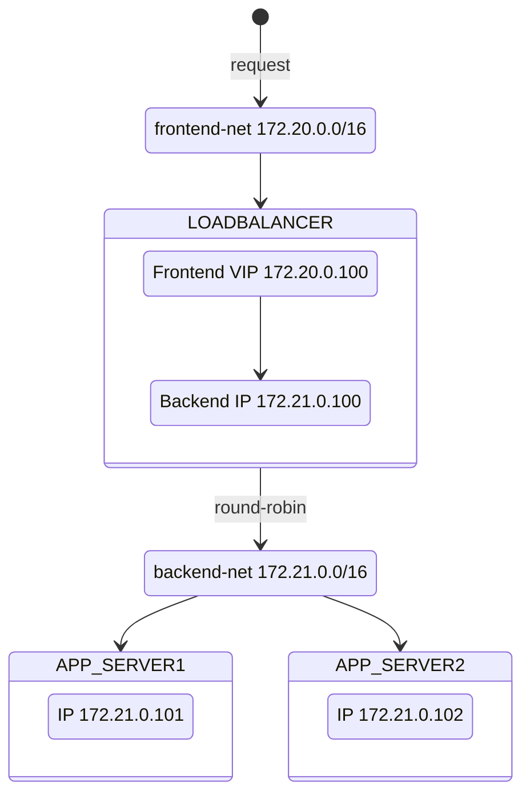

# Docker app diagram with networking

```mermaid
stateDiagram
    [*] --> net1: request

    net1: frontend-net 172.20.0.0/16
    net1 --> LOADBALANCER
    LOADBALANCER --> net2: round-robin

    net2: backend-net 172.21.0.0/16
    net2 --> APP_SERVER1
    net2 --> APP_SERVER2
    
    state LOADBALANCER {
        VIP: Frontend VIP 172.20.0.100
        APP: Backend IP 172.21.0.100
        VIP --> APP
    }
    state APP_SERVER1 {
        APP1: IP 172.21.0.101
        APP1
    }
    state APP_SERVER2 {
        APP2: IP 172.21.0.102
        APP2
    }
```
