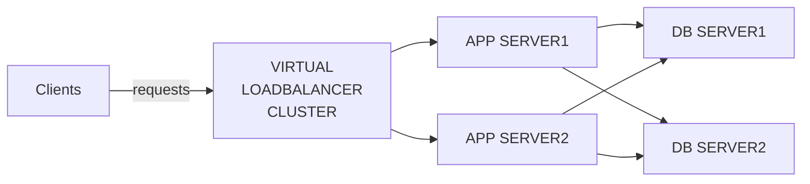

# High Availability Deployment Models

```mermaid
flowchart LR
    direction LR1
    Clients --> |requests| LB[VIRTUAL<br>LOADBALANCER<br>CLUSTER]
    LB --> A1[APP SERVER1]
    LB --> A2[APP SERVER2]
    A1 --> D1[DB SERVER1]
    A1 --> D2[DB SERVER2]
    A2 --> D1[DB SERVER1]
    A2 --> D2[DB SERVER2]
```
